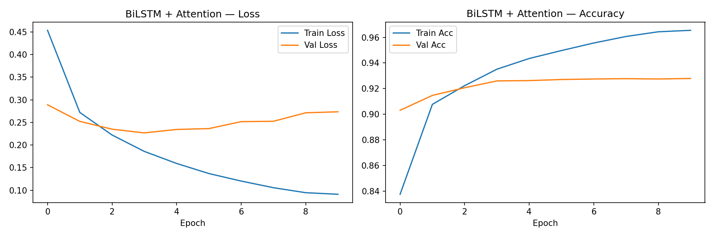

# 📰 Attention-Based News Classification

[](https://www.python.org/downloads/)
[](https://pytorch.org/)
[](https://streamlit.io/)

A comprehensive NLP system that classifies news headlines into four categories: **World, Sports, Business, and Sci/Tech**. This project implements a full machine learning lifecycle—from raw text preprocessing to a live web application deployment.

## 🚀 Project Overview

The core of this project is a comparative analysis of three architectural approaches to Natural Language Processing. The goal was to observe how moving from frequency-based models to deep contextual models impacts accuracy and error reduction.

### 🧠 The Models
1.  **TF-IDF + Logistic Regression**: A statistical baseline that treats text as a "bag of words."
2.  **BiLSTM with Additive Attention**: A custom neural network that captures sequential dependencies and uses an attention mechanism to focus on key informative tokens.
3.  **BERT Fine-Tuning**: A transformer-based approach (`bert-base-uncased`) that leverages pre-trained semantic knowledge for state-of-the-art results.

---

## 📊 Performance Benchmark

| Model Architecture | Accuracy | Macro F1-Score | Error Reduction vs. Baseline |
| :--- | :---: | :---: | :---: |
| **TF-IDF Baseline** | 92.17% | 0.9216 | - |
| **BiLSTM + Attention** | 92.66% | 0.9265 | **+6.2%** |
| **Fine-tuned BERT** | **~94.5%** | **0.944** | **~30.0%** |

---

## 📈 Deep Dive: BiLSTM + Self-Attention

While BERT provides the highest accuracy, the **BiLSTM + Attention** model is the technical heart of this project. Unlike standard RNNs, this model uses a **Bidirectional** approach to understand context from both the start and end of a headline. 

The **Additive Attention** layer allows the model to assign weights to words, essentially "learning" that words like *'IPO'* or *'Stock'* are more important for Business news than common stop-words.

### Training Progress
Below are the training and validation curves for the BiLSTM model, showing smooth convergence and successful learning without significant overfitting:



---

## 💻 Web Application Interface

I developed a real-time web interface using **Streamlit**. This allows users to input any news headline and receive an instant classification and confidence score from the fine-tuned BERT engine.

### How to run the App:
1. Ensure you have the dependencies installed: `pip install -r requirements.txt`
2. Run the command: `streamlit run app.py`

---

## 📂 Project Structure

```text
├── app.py                # Streamlit Web Application
├── checkpoints/          # Trained model weights (.pt, .safetensors)
├── configs/              # Hyperparameter settings (config.yaml)
├── data/                 # Preprocessing logic & datasets
├── evaluation/           # Performance scripts & comparison logic
├── models/               # Model architectures (BERT, BiLSTM, TF-IDF)
├── results/              # Metrics, plots, and JSON reports
└── scripts/              # Training execution scripts